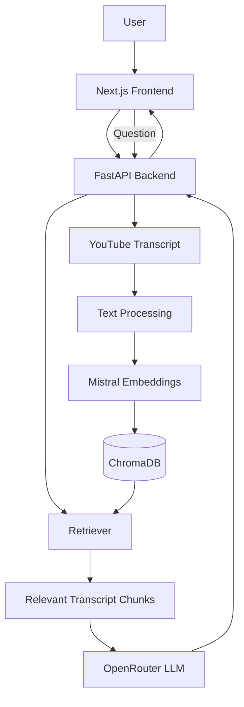

# Vidwise

**Turn videos into knowledge.**

Vidwise is an AI-powered YouTube video understanding application that helps users extract useful information from long-form video content. It can generate video summaries and answer questions about the video's content using a Retrieval-Augmented Generation (RAG) pipeline.

> Formerly known as **LaLingo**.

## Features

* 🎥 **YouTube Video Processing** — Extract and process video transcripts.
* 📝 **AI Summarization** — Generate concise summaries from video content.
* 💬 **Question Answering** — Ask questions about the video content.
* 🔎 **RAG-based Retrieval** — Retrieve relevant transcript chunks using ChromaDB.
* 🧠 **Context-Aware Answers** — Generate answers using retrieved video context.

## Tech Stack

### Frontend

* Next.js
* React
* TypeScript
* Tailwind CSS
* Axios

### Backend

* Python
* FastAPI
* LangChain
* ChromaDB
* OpenRouter API — LLM generation
* Mistral AI — Text embeddings

## Architecture



## How It Works

### Video Summarization

The user provides a YouTube video and Vidwise processes its transcript. The processed content is sent through an LLM pipeline using OpenRouter to generate a concise summary.

### Question Answering

When a user asks a question about the video:

1. The query is received by the FastAPI backend.
2. The query is used to search the ChromaDB vector store.
3. Mistral embeddings are used for semantic retrieval.
4. Relevant transcript chunks are retrieved.
5. The retrieved context is passed to an OpenRouter-hosted LLM.
6. The generated answer is returned to the frontend.

### RAG Pipeline

```text
YouTube Transcript
       ↓
Text Processing / Chunking
       ↓
Mistral Embeddings
       ↓
ChromaDB
       ↓
User Query
       ↓
Semantic Retrieval
       ↓
Relevant Transcript Context
       ↓
OpenRouter LLM
       ↓
Generated Answer
```

## API

Vidwise currently exposes two main endpoints.

### `POST /summarize`

Generates a summary from the processed video content.

Example request:

```
{
   "vid_aud":"https://www.youtube.com/watch?v=0rm7XNQJwmE",
   "summary":true,
   "language": "Mandrin"
}

Example response:

{
  "response": "The video discusses..."
}
```

### `POST /ask`

Answers a question using information retrieved from the video's transcript.

Example request:

```json
{
  "query": "(anything related to the video)"
}
```

Example response:

```json
{
  "response": "......."
}
```

> The exact request and response schemas should follow the Pydantic models implemented in the FastAPI backend.

## Project Structure

```text
Vidwise/
│
├── .venv/
│
├── client/
│   ├── .next/
│   ├── app/
│   ├── components/
│   ├── node_modules/
│   ├── public/
│   ├── .gitignore
│   ├── AGENTS.md
│   ├── CLAUDE.md
│   ├── eslint.config.mjs
│   ├── next-env.d.ts
│   ├── next.config.ts
│   ├── package.json
│   ├── package-lock.json
│   ├── postcss.config.mjs
│   ├── README.md
│   ├── tailwind.config.ts
│   └── tsconfig.json
│
├── server/
│   ├── __pycache__/
│   ├── aud_processing/
│   ├── chroma_db/
│   ├── cores/
│   ├── downloads/
│   ├── tools_and_agents/
│   ├── transcribe_and_translate/
│   ├── vectors/
│   ├── app.py
│   ├── README.md
│   ├── requirement.txt
│   └── test.py
│
├── .env
├── .gitignore
└── README.md
```

## Installation

### Clone the repository

```bash
git clone https://github.com/Muntaha369/LaLingo.git
cd Vidwise
```

### Backend

```bash
cd server
```

Create and activate a virtual environment:

```bash
python -m venv .venv
source .venv/bin/activate
```

Install dependencies:

```bash
pip install -r requirements.txt
```

Create a `.env` file and add your API credentials.

Start the FastAPI server:

```bash
uvicorn app:app --reload
```

Backend:

```text
http://localhost:8000
```

### Frontend

In another terminal:

```bash
cd client
npm install
npm run dev
```

Frontend:

```text
http://localhost:3000
```

## Environment Variables

Vidwise uses external AI services for generation and embeddings.

Example:

```env
OPENROUTER_API_KEY=your_api_key
MISTRAL_API_KEY=your_api_key
```

## Current Limitations

* Follow-up questions are currently treated as independent requests because conversation/session memory has not yet been implemented.
* Answer quality depends on the quality and availability of the video's transcript.
* Retrieval quality depends on chunking, embeddings, and the relevance of the stored transcript content.
* LLM responses depend on the selected OpenRouter model and its available context window.

## Future Improvements

* Add conversational memory and session-based chat history.
* Improve follow-up question handling through contextual query rewriting.
* Add video-specific metadata filtering during retrieval.
* Add transcript timestamps and source references to answers.
* Support streaming responses.
